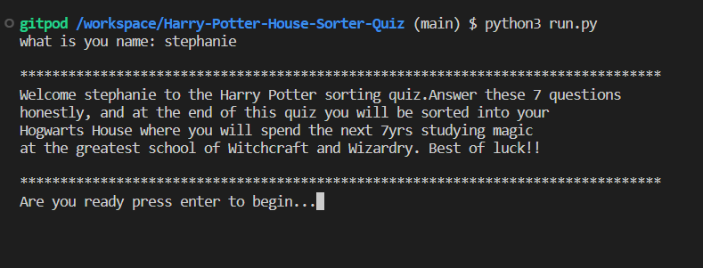
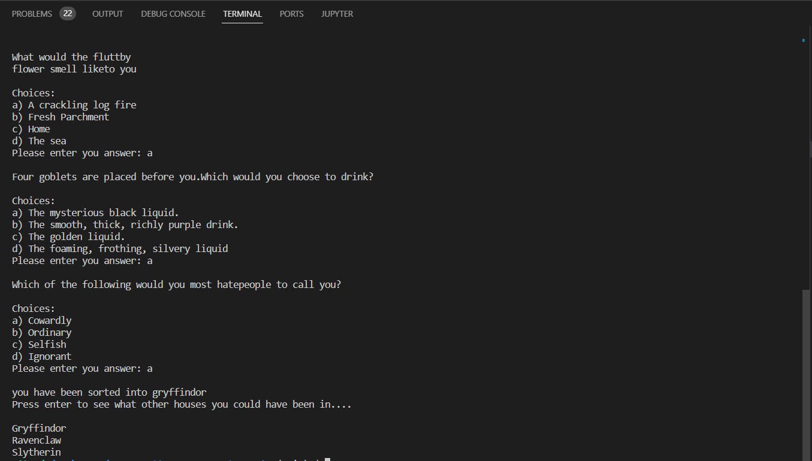
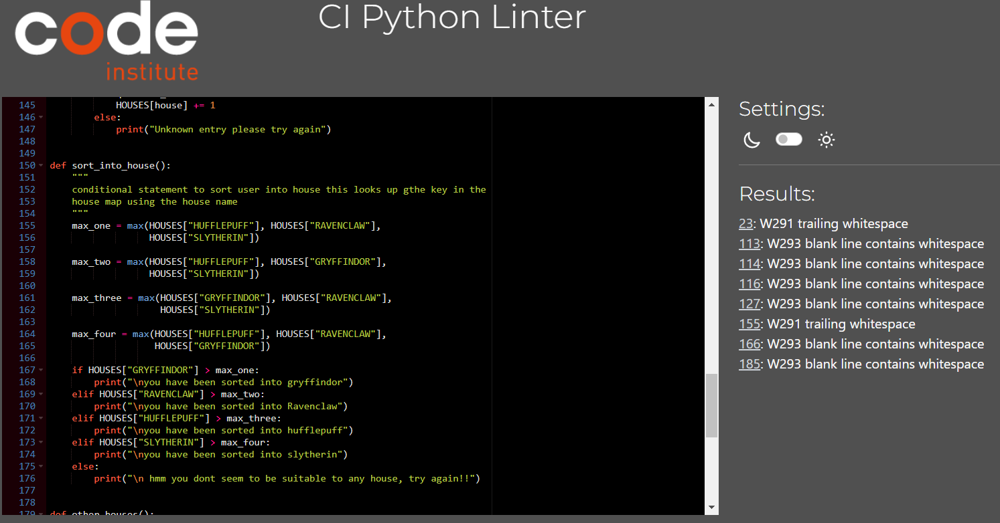

# Introduction
This is a console quiz made in Python. The purpose of this quiz is to sort the user into one of the four Hogwarts houses where they will then spend the next 7 years studying magic. Partaking in this quiz will allow the user to answer 7 multiple choiced questions based on the four houses of Hogwarts. Each question has 4 choices and of those 4 choices each one corresponds to one of the four houses GRYFFINDOR, RAVENCLAW, HUFFLEPUFF AND SLYTHERIN. After answering all questions the user will then be told which house they have been sorted into.

# How to begin
In order to play this quiz you need you use your python terminal/console on your computer. You can copy the code from my github 
[My_github](https://github.com/stephaniemaf/Harry-Potter-House-Sorter-Quiz)
The user should enter "python3 run.py" and then the quiz should load up into the console and begin.

# Existing Features

## Welcome Message:
Upon load up of the quiz the user is asked to enter theyre name, then they must press enter. After this they are met with a welcome message personalized to the user and an explenation of how the quiz works.

## Questions:
The user is then prompted to start answering questions, there are 7 in total.

## Results:
The user is then told what house they will be in for the duration of theyre stay in HOGWARTS, and then they can press enter to see which other houses they could have been sorted into.

# Bugs:
Origionally i had a bug with my for loop that even if the user enetered the wrong letter choice the next question would show anyway. To fox this i switched to a while loop.

# Testing
* I started out this quiz with just a welcome message and asked the user to input theyre name i then used an f string to parse this to the welcome message so the message would be personal for the user. I tested this out before moving on with multiple names and it worked every time.

* Next i asked the user if they where ready to begin via an input statement and asked them to press enter so as the questions would only show after a keypress. This also worked each time no problem.

* I then moved on to my questions which i stored in a list of dictionaries (map). I wanted to loop through the questions and have them print one at a time after the user answered the question. To do this i used a for loop, and an if statement to iterate of the questions, if the user entered the wrong letter(as the only possible answers are a,b,c,d) i wanted the question to be repeated without letting the user move on.As every time i tested my code by entering a wrong letter my print statement letting them know they entered the wrong letter would show up but the next question would be shown straight after that. I realised quickly my for loop was not going to work here so i replaced it with a while loop. I ran it muliple times and it was working well it repeated the same question untill the user entered a correct option.

* My next biggest issue was how i could store my question choices in the correct house variable with each house having a different letter associated with it for each question. To do this i used an array in the map and wrote my if statement to use the key value to search through the map. Then it would update the variable map with the correct number chosen.

# Validator Testing
## Tested on [Validator](https://pep8ci.herokuapp.com/)
Code passed through validator with a few trailing whitespace issues.

# Credits 
I got the idea for this quiz from [KellyLougheed](https://kellylougheed.medium.com/hogwarts-sorting-hat-with-python-ae1ab98a3c6b)

# Important links
Link to my GitHup repository

[My_github](https://github.com/stephaniemaf/Harry-Potter-House-Sorter-Quiz)
